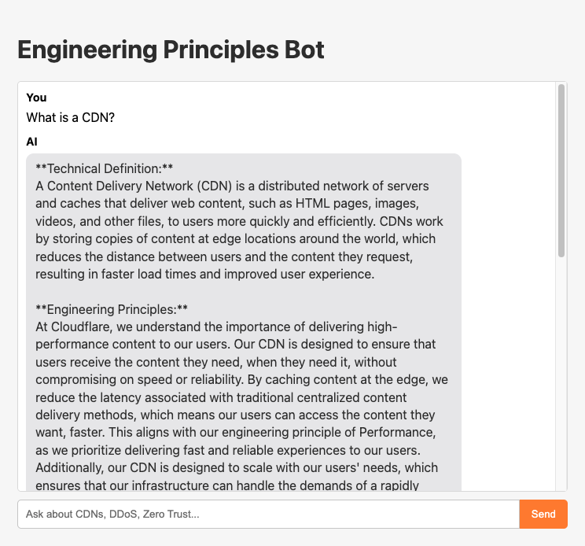

# Cloudflare Engineering Principles Bot (`cf_ai_engineering_principles_bot`)

This is an AI-powered application built for the Cloudflare 2026 Internship assignment. It acts as an expert assistant for a new engineer, explaining technical concepts through the lens of Cloudflare's core engineering principles.

---

## 🎥 Live Demo & Video Walkthrough

You can test the live, deployed application yourself at:
**[https://cf-ai-engineering-principles-bot.pages.dev](https://cf-ai-engineering-principles-bot.pages.dev)** 
*(Please note the live demo may take a few seconds to "wake up" on the first request.)*

**Click the image below to watch a 20-second video walkthrough of the bot in action:**

[  ]

---

## Project Overview

The "Engineering Principles Bot" is a chat application with a specific persona: a Senior Principal Engineer at Cloudflare. When asked a technical question (e.g., "What is a CDN?"), the bot provides a two-part response:
1.  A clear, concise technical definition.
2.  An "Engineering Principles" analysis, explaining the concept in terms of **Performance, Reliability, Security, and Scale.**

This project demonstrates an understanding of AI implementation on the Cloudflare stack and a deep alignment with the engineering values that drive Cloudflare's mission.

## Technology Stack

*   **AI Model:** Llama-3 via **Workers AI**
*   **Backend Logic:** **Cloudflare Pages Functions** (TypeScript)
*   **Frontend Interface:** **Cloudflare Pages** (HTML, CSS, JavaScript)
*   **State Management:** **Cloudflare KV** for conversational memory
*   **Development & Deployment:** **Wrangler CLI**

## Running Locally

1.  Clone the repository.
2.  Ensure you have the Wrangler CLI installed (`npm install -g wrangler`).
3.  Install dependencies: `npm install`
4.  Create the KV namespace (one-time setup): `wrangler kv:namespace create "CONVERSATION_HISTORY"` and add the output to a `wrangler.toml` file.
5.  Run the local development server: `wrangler pages dev ./frontend --local --ai=AI --kv=CONVERSATION_HISTORY`
6.  Open your browser to the local URL provided by Wrangler.

---
*This project was built in accordance with the assignment instructions, including the use of AI assistance for boilerplate code and research, as documented in `PROMPTS.md`.*